  

###  About Me:
Building web apps, full-stack projects, and AI integrations. 
Open to collaborating on startups, open-source, and creative web projects. 
Currently learning system design, AI engineering, and cloud deployment. 
Ask me about React, Next.js, JavaScript, and AI tools. 
Full-Stack Developer • UI/UX Enthusiast • AI Explorer 

#  Tech Stack:
                                                                 
###  Random Dev Quote

## GitHub Stats

  
  

##  GitHub Trophies

##  Socials:
    
---

